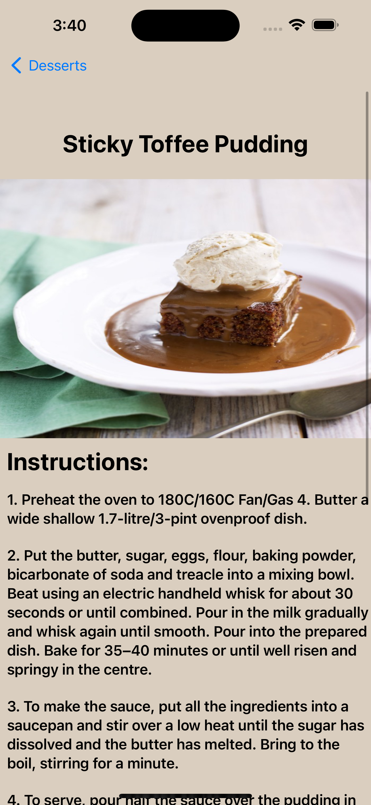
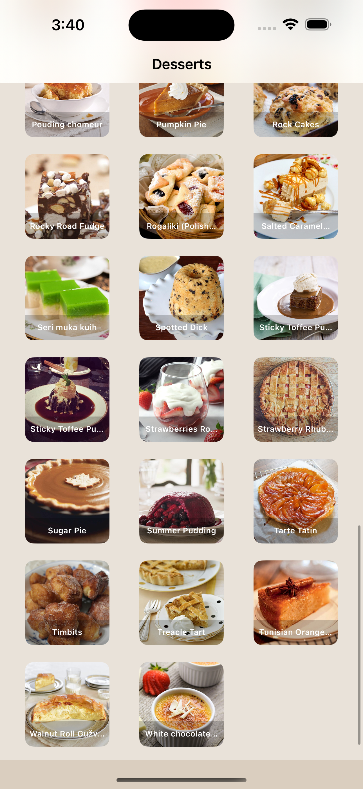

# RecipeApp

By Sam Greenhill

This is the Fetch Rewards take home test. 

## Skills Used: 
* SwiftUI
* Async Await
* Unit Tests
* MVVM design pattern

## Task: 

Please write a native iOS app that allows users to browse recipes using the
following API: https://themealdb.com/api.php

There are 2 endpoints that your app should utilize:

• https://themealdb.com/api/json/v1/1/filter.php?c=Dessert for fetching the list of meals in the Dessert category.

• https://themealdb.com/api/json/v1/1/lookup.php?i=MEAL_ID for fetching the meal details by its ID.

The user should be shown the list of meals in the Dessert category, sorted
alphabetically.

When the user selects a meal, they should be taken to a detail view that
includes:

• Meal name
• Instructions
• Ingredients/measurements

Please read the following guidelines carefully before starting the coding
challenge:

• Be sure to filter out any null or empty values from the API before displaying
them.

• UI/UX design is not what you’re being evaluated on, but the app should be
user friendly and should take basic app design principles into account.

• Project should compile using the latest version of Xcode.

## Images:

  &nbsp;&nbsp;&nbsp;&nbsp;&nbsp;&nbsp;&nbsp;&nbsp;&nbsp;&nbsp;&nbsp;&nbsp;

